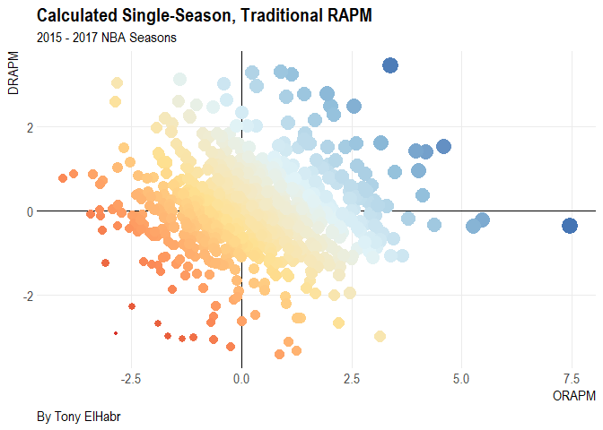

# My Estimates


```
## # A tibble: 3 x 3
##     grp data                   dummy                 
##   <int> <list>                 <list>                
## 1  2015 <data.table [262 x 6]> <data.table [262 x 6]>
## 2  2016 <data.table [269 x 6]> <data.table [269 x 6]>
## 3  2017 <data.table [263 x 6]> <data.table [263 x 6]>
```


 season  name                  rank   orapm   drapm   rapm
-------  -------------------  -----  ------  ------  -----
   2017  Stephen Curry            1    7.46   -0.36   7.10
   2017  Karl-Anthony Towns       2    3.39    3.44   6.83
   2017  Kelly Olynyk             3    4.59    1.53   6.12
   2017  Damian Lillard           4    4.18    1.41   5.59
   2017  LeBron James             5    3.95    1.43   5.38
   2017  Chris Paul               6    5.46   -0.22   5.24
   2017  Dirk Nowitzki            7    2.54    2.50   5.04
   2017  James Harden             8    5.25   -0.35   4.90
   2017  Kevin Love               9    3.16    1.61   4.78
   2017  Rodney Hood             10    1.94    2.78   4.72
   2016  Isaiah Thomas            1    4.02    0.96   4.98
   2016  Kawhi Leonard            2    4.11    0.36   4.47
   2016  JJ Redick                3    2.36    1.52   3.88
   2016  Chris Paul               4    3.80   -0.18   3.61
   2016  Gary Harris              5    1.96    1.52   3.47
   2016  Kyrie Irving             6    3.29    0.10   3.39
   2016  Lou Williams             7    2.75    0.54   3.29
   2016  Marreese Speights        8    3.01    0.24   3.25
   2016  James Harden             9    2.28    0.82   3.11
   2016  Kemba Walker            10    2.87    0.22   3.09
   2015  Brandon Rush             1    2.01    2.50   4.51
   2015  Wesley Matthews          2    2.64    1.06   3.70
   2015  Reggie Jackson           3    2.95    0.61   3.56
   2015  Kyrie Irving             4    1.98    1.09   3.07
   2015  Chris Paul               5    3.02   -0.10   2.93
   2015  Donald Sloan             6    2.08    0.83   2.91
   2015  T.J. McConnell           7    2.44    0.47   2.91
   2015  Mirza Teletovic          8    1.82    1.03   2.86
   2015  Jrue Holiday             9    2.16    0.67   2.83
   2015  Kobe Bryant             10    1.29    1.52   2.81

Check against: https://public.tableau.com/views/14YearRAPM/14YearRAPM?%3Aembed=y&%3AshowVizHome=no





# Comparisons


## With basketball-analytics


## With ESPN


## Cause(s) for Differences?


