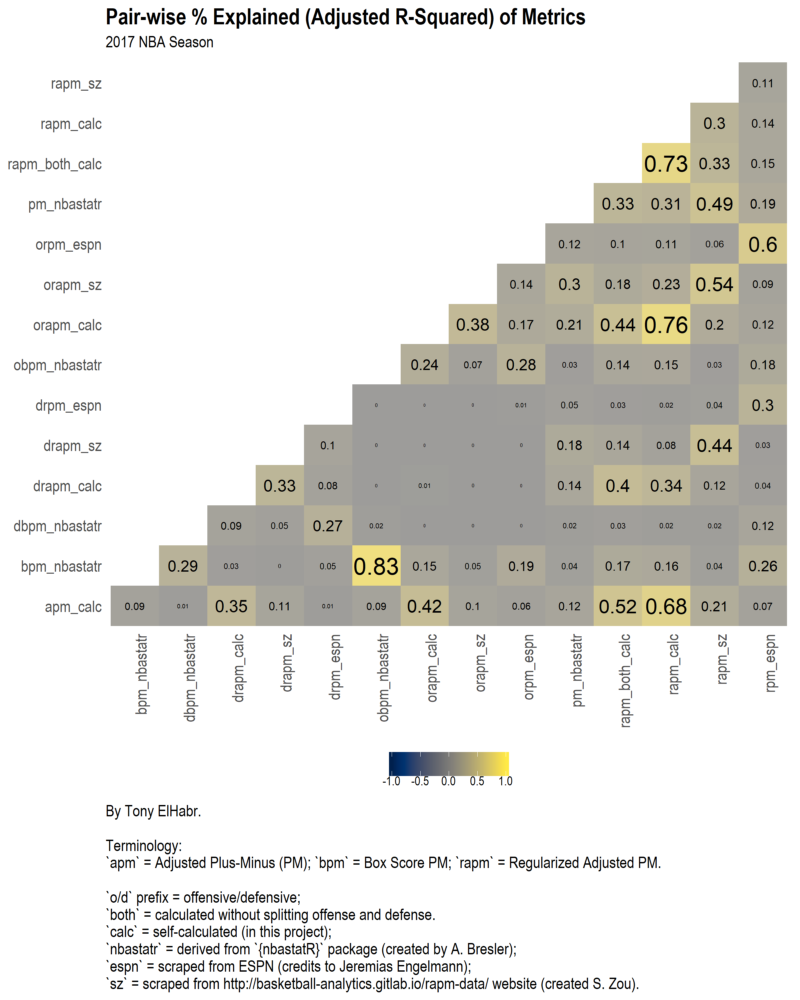
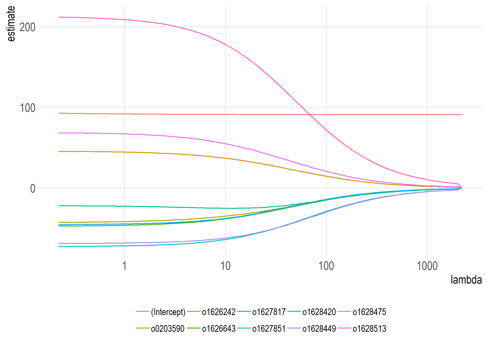
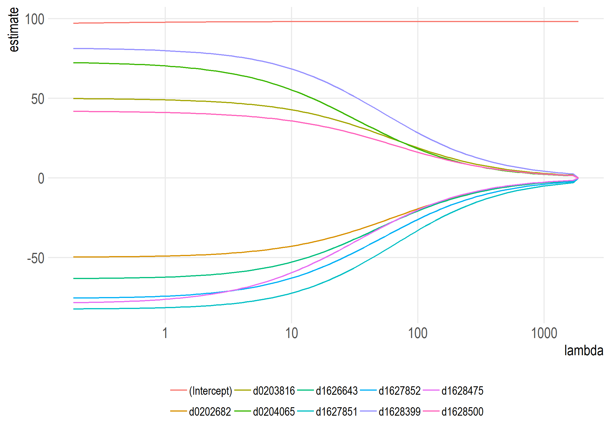
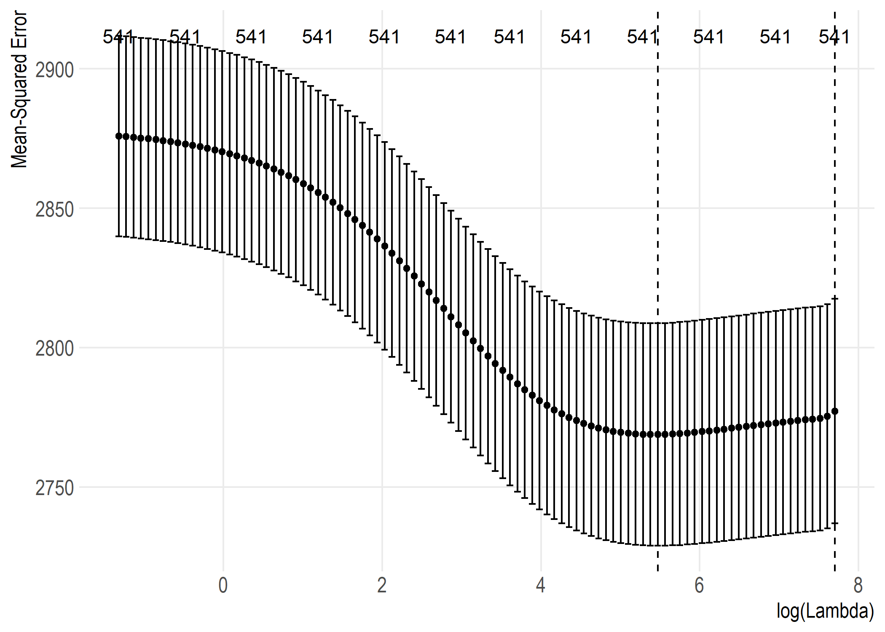
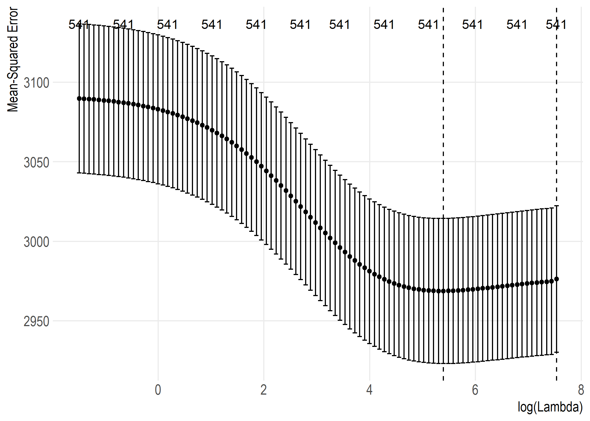

```{r setup, include = FALSE}
knitr::opts_chunk$set(
  error = FALSE,
  warning = FALSE,
  echo = TRUE
)
```

<!-- README.md is generated from README.Rmd. Please edit that file -->

# Introduction

This primary goal of this project is to calculate 
[Regularized Adjusted Plus-Minus](https://www.nbastuffer.com/analytics101/regularized-adjusted-plus-minus-rapm/) 
(RAPM)---an "advanced statistic"---for NBA players. 
The calculated values can be found in the set of `metrics_join` 
CSVs in the project's repository.

I plan to write about this project in more detail [on my blog](https://tonyelhabr.rbind.io).
so I encourage the reader to read more about it there.

# Usage

If you were to fork this project and try to run it from scratch, below
shows the required order of function calls.

First, download all of the data needed.

```{r usage_all, eval = FALSE}
# pre-process ----
# Note that `overwrite = FALSE` is the default, but setting it explciitly here to remind
# the user that it is an option.
# This goes to the
download_pbp_raw_files(overwrite = FALSE)

download_nbastatr(overwrite = FALSE)
download_rpm_espn(overwrite = FALSE)
download_rapm_sz(overwrite = FALSE)
```

Next, run the "main" function. This is what is run with the command-line interface (CLI)
that also comes with the project.

```{r usage_main, eval = FALSE}
# This reads from the config.yml files.
auto_main()
```

# Highlights

Below is a visual comparison of various RAPM-related metrics, 
either calculated in this project (i.e. `calc`) or retrieved from an external source.



The data behind this visual

```{r metrics_join_summary, echo = FALSE}
metrics_join_summary <-
  .import_data_from_path(
    verbose = FALSE,
    season = .SEASON,
    path = config$path_metrics_join_summary
  )
metrics_join_summary %>%
  spread(x, adj_r_squared) %>% 
  knitr::kable()
```

Top 20 RAPM players for 2017 (according to my calculations, which are probably off `r emo::ji('laugh')`)

```{r rapm_coefs_calc, echo = FALSE}
rapm_coefs_calc <-
  .import_data_from_path(
    verbose = FALSE,
    season = .SEASON,
    path = config$path_rapm_coefs_calc
  )
rapm_coefs_calc %>%
  mutate_at(vars(matches('rapm$')), ~scales::number(., accuracy = .01)) %>% 
  select(-id) %>% 
  head(20) %>% 
  knitr::kable()
```


2017 offensive RAPM coefficients for top 10 players as a function of cross-validated (CV) log-lambda values




2017 defensive RAPM coefficients for top 10 players



Ridge regression CV lambda penalties for 2017 offensive RAPM



Ridge regression CV lambda penalties for 2017 defensive RAPM


