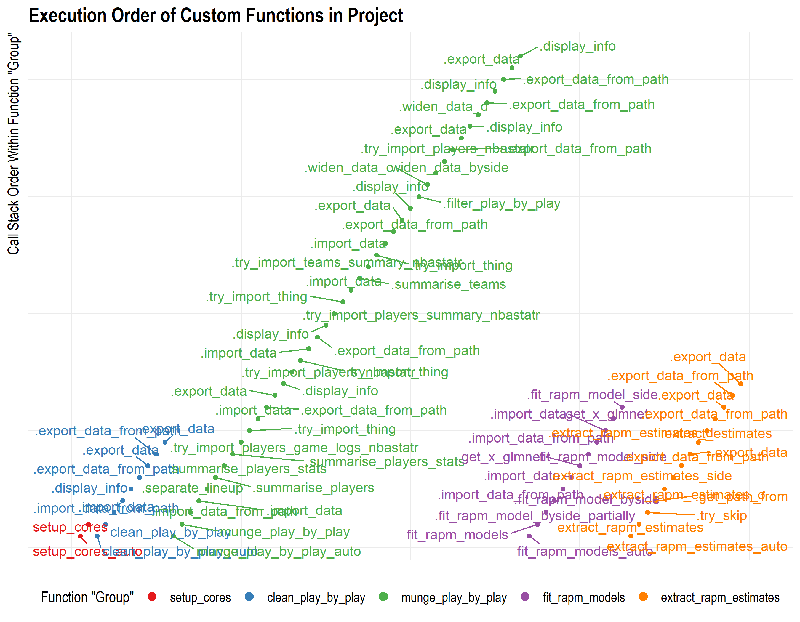

# Introduction

This primary goal of this project is to calculate 
[Regularized Adjusted Plus-Minus](https://www.nbastuffer.com/analytics101/regularized-adjusted-plus-minus-rapm/) 
(RAPM)---an "advanced statistic"---for NBA players. 
The calculated values can be found in the set of `rapm_estimates` 
CSVs in the project's repository.

I've written about this project in more detail [on my blog](https://tonyelhabr.rbind.io).
so I encourage the reader to read more about it there.

# Highlights

# TODO(?)

+ Fix stint function.
+ Re-do calculations to follow code shown at
    + https://squared2020.com/2017/09/18/deep-dive-on-regularized-adjusted-plus-minus-i-introductory-example/
    + https://squared2020.com/2017/09/18/deep-dive-on-regularized-adjusted-plus-minus-ii-basic-application-to-2017-nba-data-with-r/.
