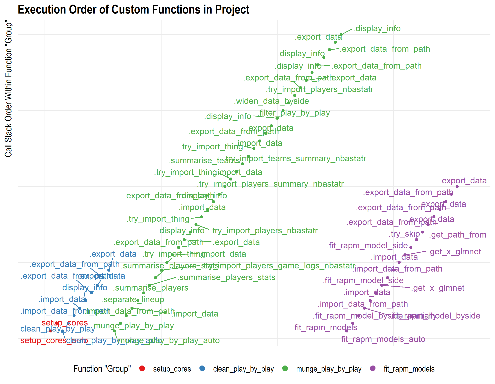
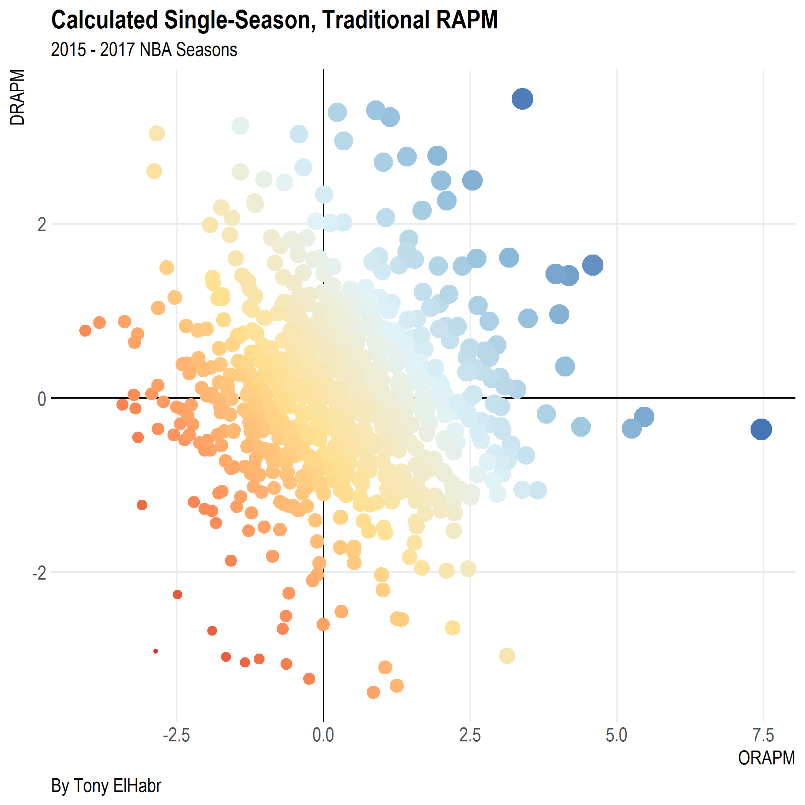

<!-- README.md is generated from README.Rmd. Please edit that file -->

# Introduction

This primary goal of this project is to calculate [Regularized Adjusted
Plus-Minus](https://www.nbastuffer.com/analytics101/regularized-adjusted-plus-minus-rapm/)
(RAPM)—an “advanced statistic”—for NBA players. The calculated values
can be found in the set of `rapm_estimates` CSVs in the project’s
repository.

I’ve written about this project in more detail [on my
blog](https://tonyelhabr.rbind.io). so I encourage the reader to read
more about it there.

# Highlights

 

# TODO(?)

  - FIX `MUNGE` FUNCTION\!

  - \[x\] Check that filtering in `munge` function is done correctly.

  - \[x\] Try no intercept with `{glmnet}` model. UPDATE: It returns
    weird results.

  - \[x\] Check/emultate how `{glmnet}` is used
        at:
    
      - <https://github.com/dgrtwo/data-screencasts/blob/3e1e3d0e14abdff00ae1493d4273e8f3b49a0a77/medium-datasci.Rmd>
      - <https://github.com/juliasilge/blog_by_hugo/blob/f847b7836bfcedc396e7e82867c4601ae8357853/content/blog/2018/2018-12-24-tidy-text-classification.Rmd>

  - \[x\] Re-do calculations to follow code shown
        at
    
      - <https://squared2020.com/2017/09/18/deep-dive-on-regularized-adjusted-plus-minus-i-introductory-example/>
      - <https://squared2020.com/2017/09/18/deep-dive-on-regularized-adjusted-plus-minus-ii-basic-application-to-2017-nba-data-with-r/>.
      - <https://squared2020.com/2018/12/24/regularized-adjusted-plus-minus-part-iii-what-had-really-happened-was/>
          - Note: I’m 99% confident that I’m not making the additive
            rating mistake identified in the article (because I
            calculate `pp100poss` AFTER summing `pts` across all
            possessions `n`).
          - Maybe try combining offensive and defensive matrices(?),
            although Jacobs seems to take opinions on both sides of the
            argument of whether or not this should be done.

  - \[ \] Re-do `clean` and `munge` functions with `{data.table}` (and
    use S3 methods to differentiate with `{tibble}` methods).

  - \[ \] Compare calculations with those at <http://nbashotcharts.com/>
    (e.g. <http://nbashotcharts.com/rapm?id=1113190703> for 2017 season)

  - \[ \] Create function to automatically plot ORAPM vs. DRAPM.
    (Code/logic is already in one of the `.Rmd` files.)

  - \[ \] LOW PRIORITY: Create function to regenerate profile html
    widgets. (Code/logic already exists somewhere in the project.)

  - \[ \] Implement RAPM that considers both offense and defense
    simulatenously(?)

  - \[ \] Move filtering function to last step before fitting (so that
    `munge` step can possibly be skipped).

  - \[ \] Evaluate variance of coefficients.

  - \[ \] Standardize dummy/indicator variables for players in stints by
    number of possessions(?)

  - \[ \]
