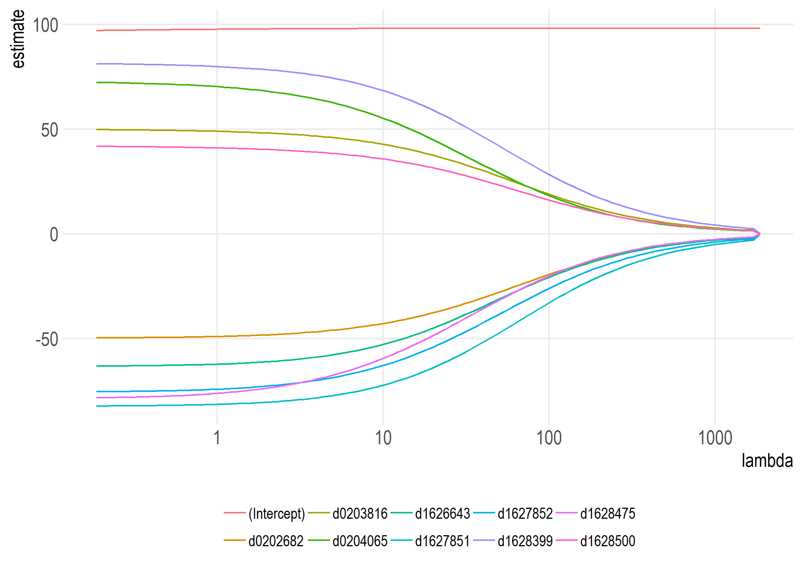
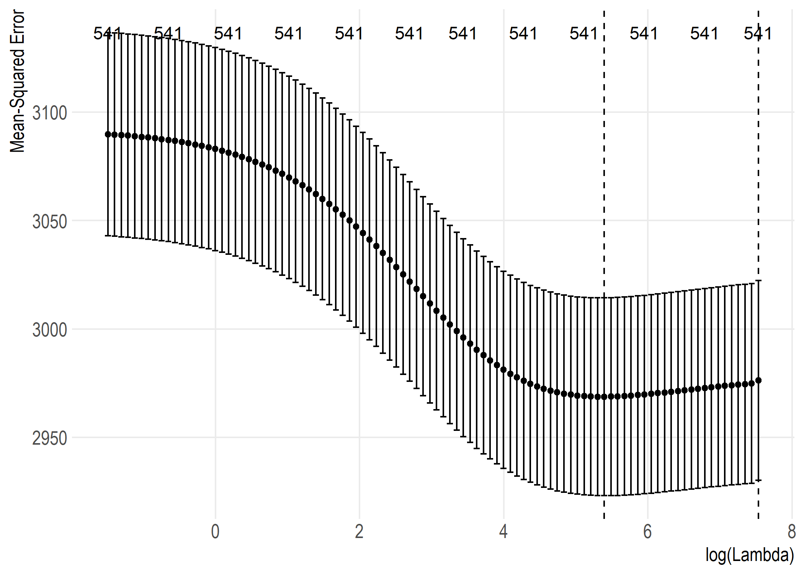

<!-- README.md is generated from README.Rmd. Please edit that file -->

# Introduction

This primary goal of this project is to calculate [Regularized Adjusted
Plus-Minus](https://www.nbastuffer.com/analytics101/regularized-adjusted-plus-minus-rapm/)
(RAPM)—an “advanced statistic”—for NBA players. The calculated values
can be found in the set of `metrics_join` CSVs in the project’s
repository.

I plan to write about this project in more detail [on my
blog](https://tonyelhabr.rbind.io). so I encourage the reader to read
more about it there.

# Usage

If you were to fork this project and try to run it from scratch, below
shows the required order of function calls.

First, download all of the data needed.

``` r
# pre-process ----
# Note that `overwrite = FALSE` is the default, but setting it explciitly here to remind
# the user that it is an option.
# This goes to the
download_pbp_raw_files(overwrite = FALSE)

download_nbastatr(overwrite = FALSE)
download_rpm_espn(overwrite = FALSE)
download_rapm_sz(overwrite = FALSE)
```

Next, run the “main” function. This is what is run with the command-line
interface (CLI) that also comes with the project.

``` r
# This reads from the config.yml files.
auto_main()
```

# Highlights

Below is a visual comparison of various RAPM-related metrics, either
calculated in this project (i.e. `calc`) or retrieved from an external
source.


The data behind this visual

| y                | apm\_calc | bpm\_nbastatr | dbpm\_nbastatr | drapm\_calc |   drapm\_sz |  drpm\_espn | obpm\_nbastatr | orapm\_calc |   orapm\_sz |  orpm\_espn | pm\_nbastatr | rapm\_both\_calc | rapm\_calc |  rapm\_sz | rpm\_espn |
| :--------------- | --------: | ------------: | -------------: | ----------: | ----------: | ----------: | -------------: | ----------: | ----------: | ----------: | -----------: | ---------------: | ---------: | --------: | --------: |
| apm\_calc        |        NA |     0.0857897 |      0.0068202 |   0.3504192 |   0.1118109 |   0.0059843 |      0.0863602 |   0.4191907 |   0.0972412 |   0.0633819 |    0.1194202 |        0.5170582 |  0.6750558 | 0.2135919 | 0.0727325 |
| bpm\_nbastatr    | 0.0857897 |            NA |      0.2852047 |   0.0273031 |   0.0027746 |   0.0471514 |      0.8274349 |   0.1482843 |   0.0453781 |   0.1901469 |    0.0437862 |        0.1743086 |  0.1600988 | 0.0418785 | 0.2560962 |
| dbpm\_nbastatr   | 0.0068202 |     0.2852047 |             NA |   0.0912274 |   0.0503027 |   0.2727653 |      0.0168123 | \-0.0024059 | \-0.0017948 | \-0.0018229 |    0.0191676 |        0.0321596 |  0.0191713 | 0.0189409 | 0.1234330 |
| drapm\_calc      | 0.3504192 |     0.0273031 |      0.0912274 |          NA |   0.3322217 |   0.0765407 |    \-0.0020656 |   0.0098078 | \-0.0003777 | \-0.0027973 |    0.1413987 |        0.4035084 |  0.3356299 | 0.1240432 | 0.0358574 |
| drapm\_sz        | 0.1118109 |     0.0027746 |      0.0503027 |   0.3322217 |          NA |   0.1041948 |    \-0.0009822 | \-0.0023232 | \-0.0017017 | \-0.0006295 |    0.1791320 |        0.1442801 |  0.0756311 | 0.4384602 | 0.0256227 |
| drpm\_espn       | 0.0059843 |     0.0471514 |      0.2727653 |   0.0765407 |   0.1041948 |          NA |    \-0.0008774 | \-0.0029342 | \-0.0026649 |   0.0064440 |    0.0491640 |        0.0298905 |  0.0175993 | 0.0421981 | 0.3028806 |
| obpm\_nbastatr   | 0.0863602 |     0.8274349 |      0.0168123 | \-0.0020656 | \-0.0009822 | \-0.0008774 |             NA |   0.2368059 |   0.0650393 |   0.2843836 |    0.0300633 |        0.1443483 |  0.1512988 | 0.0278430 | 0.1757929 |
| orapm\_calc      | 0.4191907 |     0.1482843 |    \-0.0024059 |   0.0098078 | \-0.0023232 | \-0.0029342 |      0.2368059 |          NA |   0.3812504 |   0.1694076 |    0.2074359 |        0.4420484 |  0.7619807 | 0.2037157 | 0.1178648 |
| orapm\_sz        | 0.0972412 |     0.0453781 |    \-0.0017948 | \-0.0003777 | \-0.0017017 | \-0.0026649 |      0.0650393 |   0.3812504 |          NA |   0.1361238 |    0.3027395 |        0.1785147 |  0.2277643 | 0.5434344 | 0.0906094 |
| orpm\_espn       | 0.0633819 |     0.1901469 |    \-0.0018229 | \-0.0027973 | \-0.0006295 |   0.0064440 |      0.2843836 |   0.1694076 |   0.1361238 |          NA |    0.1209535 |        0.1041428 |  0.1121011 | 0.0596036 | 0.6037412 |
| pm\_nbastatr     | 0.1194202 |     0.0437862 |      0.0191676 |   0.1413987 |   0.1791320 |   0.0491640 |      0.0300633 |   0.2074359 |   0.3027395 |   0.1209535 |           NA |        0.3326310 |  0.3124833 | 0.4888706 | 0.1893420 |
| rapm\_both\_calc | 0.5170582 |     0.1743086 |      0.0321596 |   0.4035084 |   0.1442801 |   0.0298905 |      0.1443483 |   0.4420484 |   0.1785147 |   0.1041428 |    0.3326310 |               NA |  0.7345316 | 0.3308535 | 0.1489425 |
| rapm\_calc       | 0.6750558 |     0.1600988 |      0.0191713 |   0.3356299 |   0.0756311 |   0.0175993 |      0.1512988 |   0.7619807 |   0.2277643 |   0.1121011 |    0.3124833 |        0.7345316 |         NA | 0.2980069 | 0.1374234 |
| rapm\_sz         | 0.2135919 |     0.0418785 |      0.0189409 |   0.1240432 |   0.4384602 |   0.0421981 |      0.0278430 |   0.2037157 |   0.5434344 |   0.0596036 |    0.4888706 |        0.3308535 |  0.2980069 |        NA | 0.1136859 |
| rpm\_espn        | 0.0727325 |     0.2560962 |      0.1234330 |   0.0358574 |   0.0256227 |   0.3028806 |      0.1757929 |   0.1178648 |   0.0906094 |   0.6037412 |    0.1893420 |        0.1489425 |  0.1374234 | 0.1136859 |        NA |

Top 20 RAPM players for 2017 (according to my calculations, which are
probably off 😆)

| name                | slug | rank | drapm  | orapm | rapm |
| :------------------ | :--- | ---: | :----- | :---- | :--- |
| Dante Exum          | UTA  |    1 | 2.69   | 3.43  | 6.12 |
| Stephen Curry       | GSW  |    2 | \-0.15 | 5.04  | 4.90 |
| Marcus Georges-Hunt |      |    3 | \-1.07 | 5.79  | 4.71 |
| Jordan Bell         | GSW  |    4 | 1.00   | 3.39  | 4.38 |
| Brandan Wright      |      |    5 | 2.66   | 0.99  | 3.66 |
| OG Anunoby          | TOR  |    6 | 1.30   | 2.33  | 3.63 |
| Iman Shumpert       | SAC  |    7 | 2.78   | 0.79  | 3.57 |
| Chris Paul          | HOU  |    8 | 0.32   | 3.05  | 3.37 |
| Nene                | HOU  |    9 | 1.04   | 2.16  | 3.20 |
| Mike Conley         | MEM  |   10 | 2.19   | 0.94  | 3.13 |
| Eric Gordon         | HOU  |   11 | 1.04   | 2.07  | 3.11 |
| Torrey Craig        | DEN  |   12 | 0.83   | 2.26  | 3.09 |
| Lucas Nogueira      |      |   13 | 1.14   | 1.90  | 3.04 |
| PJ Tucker           | HOU  |   14 | 0.76   | 2.22  | 2.99 |
| Robert Covington    | MIN  |   15 | 1.09   | 1.88  | 2.97 |
| Zaza Pachulia       | DET  |   16 | 0.31   | 2.57  | 2.88 |
| Thabo Sefolosha     | UTA  |   17 | 1.02   | 1.83  | 2.85 |
| Ersan Ilyasova      | MIL  |   18 | 1.02   | 1.57  | 2.59 |
| Joel Embiid         | PHI  |   19 | 0.97   | 1.49  | 2.46 |
| Ekpe Udoh           | UTA  |   20 | 1.00   | 1.46  | 2.46 |

2017 offensive RAPM coefficients for top 10 players as a function of
cross-validated (CV) log-lambda values


2017 defensive RAPM coefficients for top 10 players



Ridge regression CV lambda penalties for 2017 offensive RAPM


Ridge regression CV lambda penalties for 2017 defensive RAPM


